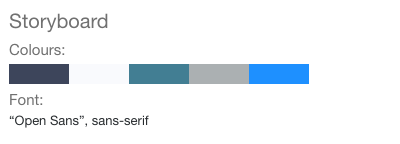

# Design Document

This website is made using Gatsby.js and Netlify CMS, they both work extremely well together and is easily maintainable.

## Site Requirements

I will create a Gatsby and Netlify website, which will be used for creating the following pages...

This website will take in a total of seven (7) pages. There will be a Home Page, About Page, Blog Page, Terms Page, Policy Page, Contact Page and Gallery Page.

### Plugin Creation

A plugin will be made for getting images from Pixabay.com through its API and display, those images in a gallery page.

The Plugin is called `DaynesImagePlugin` and will be stored locally in the project.

# Colour and Fonts

## Wireframes

My two Wireframes for the Contact Page and the Blog Template Page are located in the Wireframes Folder

## Storyboards

**Note** I haven't done storyboards for the Terms, Policy a Gallery Page, the Terms and Policy will have the exact same design as the About Storyboard, and the Gallery will displays a list of images using my plugin.

Storyboards are located in the Storyboards folder!
